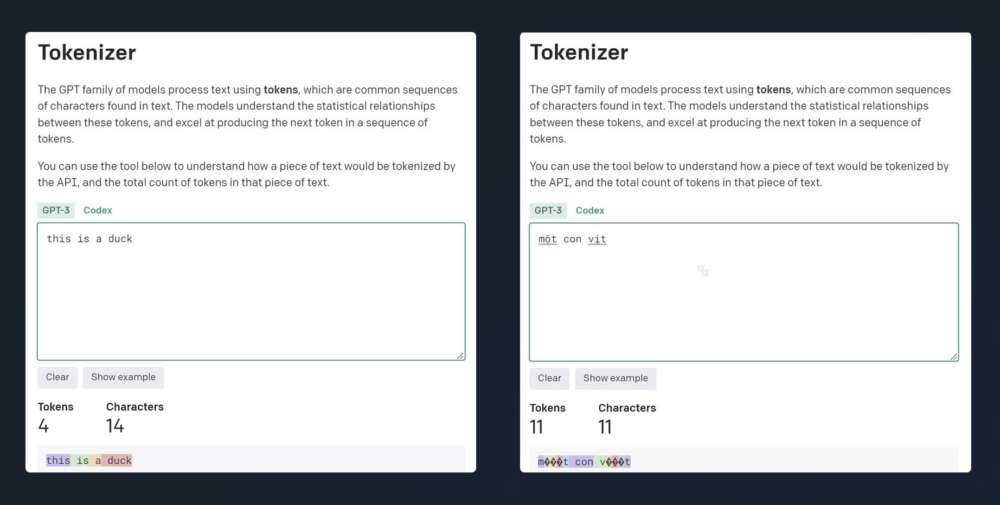
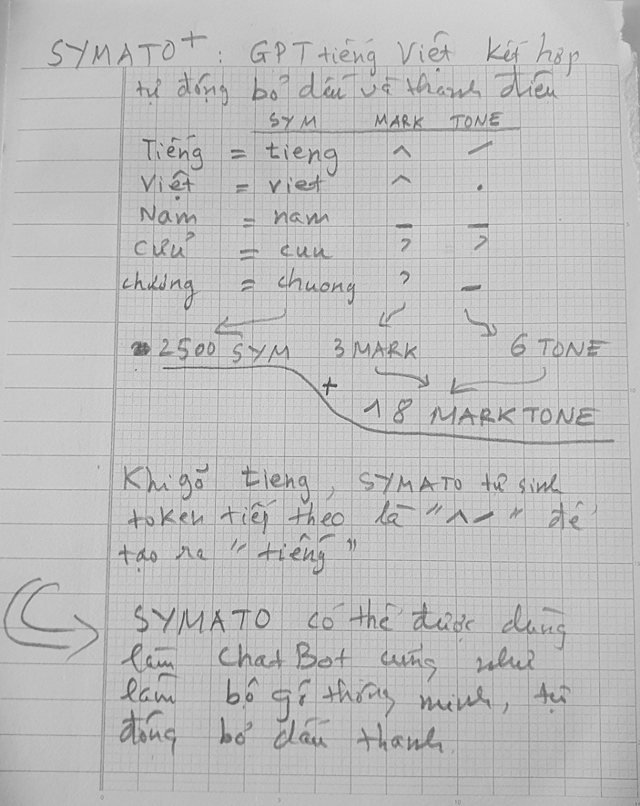
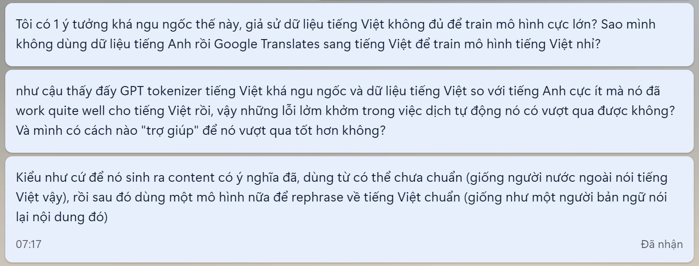

TODOs

- [x] Tìm cách tokenization hợp với tiếng việt => xem [SYMATO](#symato)
- [x] Đọc hiểu RWKV => [xem rwkv.md](./docs/rwkv.md)
- [ ] Viết lại RWKV inference engine
- [ ] Đọc hiểu và thử tối ưu WKV-Cuda
- [ ] RWKV vs NanoGPT với âm tiết tiếng Việt

- - -

Thử nghiệm để trả lời nhũng câu hỏi dưới về mô hình ngôn ngữ lớn (GPT-3, PaLM ...). Bước đầu tiên là thiết lập các thử nghiệm theo [RWKV](https://github.com/BlinkDL/RWKV-LM) với bộ dữ liệu càng thuần Việt càng tốt, tập trung vào âm tiết tiếng Việt, mục đích là để làm nhẹ bộ tham số và làm nổi bật đặc trưng của tiếng Việt.

- Liệu có thể lặp lại scaling law chỉ với một lượng dữ liệu và tính toán hạn chế? (xem cramming paper)

- Liệu có thể lặp lại scaling law chỉ với một tác vụ nhỏ trong xử lý ngôn ngữ? (xem santacoder)

- Các cách khác nhau để khai thác mô hình mà chưa cần fine-tune?

- Các cách khác nhau để tăng độ hiệu quả của một mô hình? (tiếp tục pre-train, fine-tune cho từng tác vụ, RLHL ...)

- Bao nhiêu lượng dữ liệu là đủ để pre-train tiếp một mô hình đang có cho một ngôn ngữ lạ?

- Liệu những gì nó học được từ ngôn ngữ này có thể "mang sang" ngôn ngữ khác không?

- Với một lượng dữ liệu nhất định, của một domain cụ thể thì nên tokenization như thế nào? Bao nhiêu params / training bao lâu là đủ?

- Làm sao để tăng khả năng sử dụng tối đa sức mạnh phần cứng đang có để huấn luyện mô hình?
  - FlashRWKV: tối ưu RWKV theo cách FlashAttention và FlashConv làm được cho Self-Attention và State Space Models (H3 paper)
  - AMP: Auto-Mixed Precision + BitsAndBytes quantization
  - Sử dụng [2:4 spare matrix](https://timdettmers.com/2023/01/16/which-gpu-for-deep-learning/#Sparse_Network_Training) (có thể coi đây là Dropout với p = 0.5)
  - Viết lại bằng C++/CUDA framework (tham khảo [tiny-cuda-nn](https://github.com/NVlabs/tiny-cuda-nn))

- - -

## Tại sao cần pre-train cho riêng tiếng Việt?

Các mô hình ngôn ngữ lớn hiện nay bị thống trị bởi tiếng Anh và các ngôn ngữ gốc La-tinh, ngôn ngữ Việt do dữ liệu ít và đặc trưng riêng (các ký tự utf-8 mã hóa 2-4 bytes) nên khi tokenization sẽ trở nên lép vế (xem hình dưới). Từ đấy dẫn tới thiệt hại về cả hiệu suất và kinh tế (nhiều tokens / words thì sinh câu chậm hơn, tốn tài nguyên hơn)

Minh họa trên cho thấy cùng một đoạn văn có độ dài tương đương, số lượng tokens tiếng Việt nhiều gấp 4 lần tiếng Anh. Hệ quả là độ dài ngữ cảnh giảm đi 1/4, tốc độ sinh dữ liệu chậm đi 4 lần và nếu tính tiền theo token thì tiếng Việt cũng bị tính nhiều hơn 4 lần so với tiếng Anh.

Nguyên nhân là do bộ tokenization của chatgpt được tối ưu cho tiếng Anh và các ngôn ngữ La-tinh, vì thế nó không hiểu được nhiều mã unicode tiếng Việt (được encode bằng 2-4 bytes), cụ thể ký tự "ữ" trong "ngôn ngữ" bị tokenized thành 3 bytes (thể hiện bằng 3 dấu ??? ở minh họa trên). Tuy cách tokenize rất bất lợi cho tiếng Việt, cộng thêm lượng dữ liệu huấn luyện bị lép vế so với tiếng Anh nhưng kết quả chatgpt vẫn rất ấn tượng với tiếng Việt.

## Symato
Trả lời câu hỏi: Cách tokenization nào hợp với tiếng Việt?

Âm tiết tiếng Việt chiếm ~80% trong text corpus, nó chính là đặc trưng của cả tiếng nói và chữ viết Việt. Dùng âm tiết làm đơn vị là hợp lý. Tiếng Việt viết ~16K âm tiết có ý nghĩa, 12K âm tiết thường dùng, khi phân tách ra thành cách viết không dấu (sym) + dấu (mark) và thanh điệu (tone) thì số lượng đơn vị giảm đi đáng kể. Chỉ còn khoảng 2500 sym và 18 marktone. Như vậy với 2560 tokens là có thể cover hết được sym + marktone và còn thêm các token khác để biểu thị viết hoa vs viết thường, và các trường hợp khác.

Như vậy chỉ cần bộ vocab 2816 tokens (2560 symato + 256 bytes) là có thể tokenization hiệu quả mọi corpus tiếng Việt. Nếu bạn 

## Others

