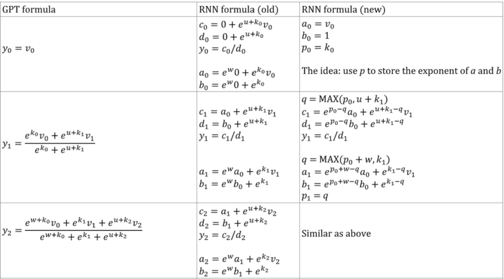

## RWKV-4 improvements
https://github.com/BlinkDL/RWKV-LM/tree/main/RWKV-v4neo/cuda

```c
__global__ void kernel_forward(const int B, const int T, const int C,
                               const F * const _w, const F * const _u, 
                               const F * const _k, const F * const _v, F * const _y) {
    const int idx = blockIdx.x * blockDim.x + threadIdx.x; // global index
    const int _b = idx / C; // mẻ thứ _b của ma trận đầu vào
    const int _c = idx % C; // channel thứ _c đang xem xét (_c = 0..C)
    const int _offset = _b * T * C + _c;

    F u = _u[_c]; // giá trị channel _c của _u = khởi tạo W_0
    F w = _w[_c]; // gia trị channel _c của _w = time-decay của W_c
    const F *__restrict__ const k = _k + _offset; // trỏ tới channel _c của key (để lấy giá trị)
    const F *__restrict__ const v = _v + _offset; // trỏ tới channel _c của value (để lấy giá trị)
          F *__restrict__ const y = _y + _offset; // trỏ tới channel _c của đầu ra (để gán giá trị)

    F p = 0, q = 0, o = MIN_VALUE;
    // p and q are running sums divided by exp(o) (to avoid overflows)
    for (int i = 0; i < T; i++) { // với mỗi token trong T token x_i
        const int ii = i * C; // trỏ tới giá trị channel _c của token x_i

        F no = max(o, u + k[ii]);
        F A = exp(o - no);
        F B = exp(u + k[ii] - no);
        y[ii] = (A*p + B*v[ii]) / (A*q + B);

        no = max(w + o, k[ii]);
        A = exp(w + o - no);
        B = exp(k[ii] - no);
        p = A*p + B*v[ii];
        q = A*q + B;
        o = no;
    }
}
```
Note: rwkv-4 sử dụng công thức rnn mới


# Tại sao lại dùng công thức mới?